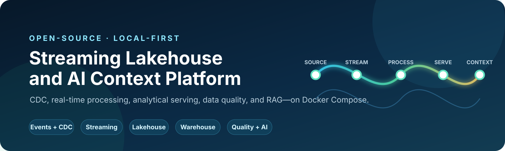
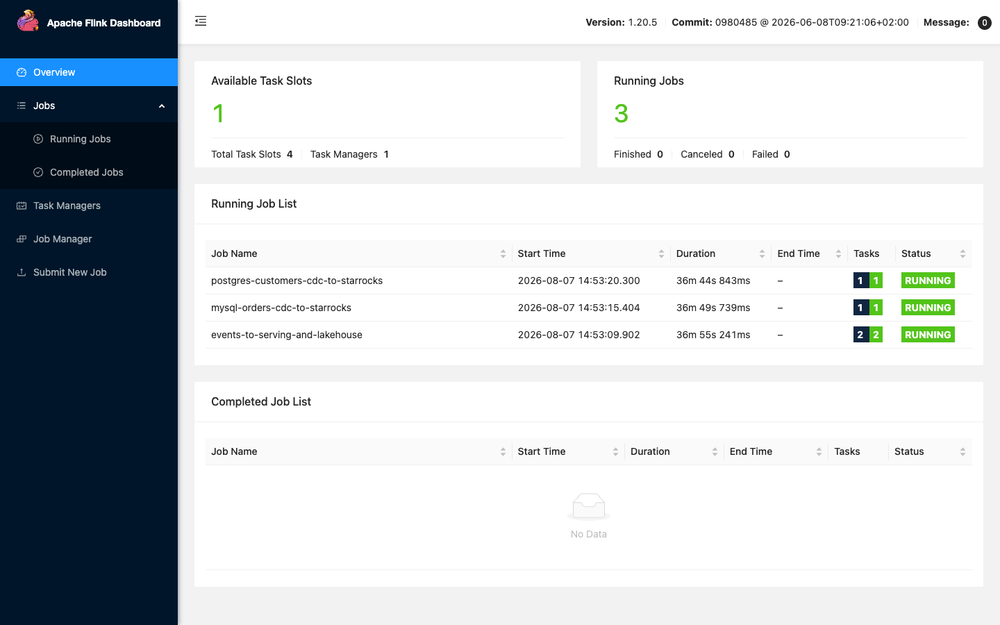
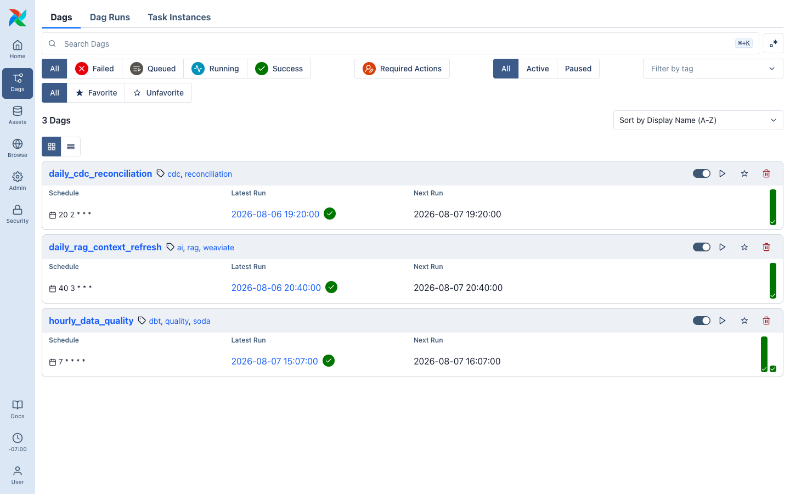
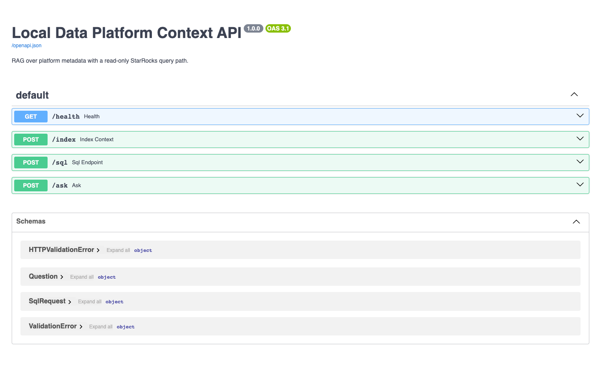
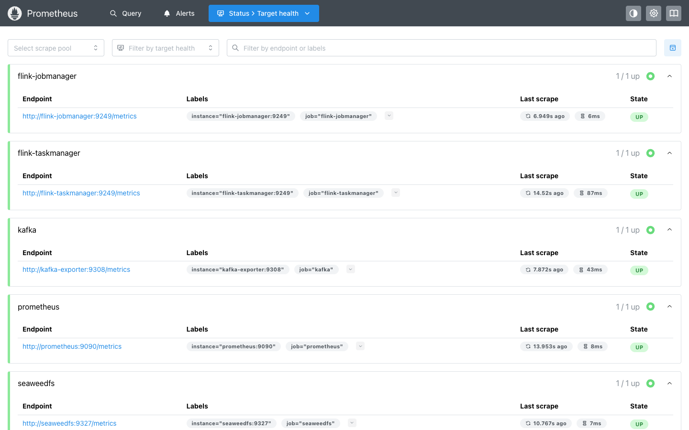
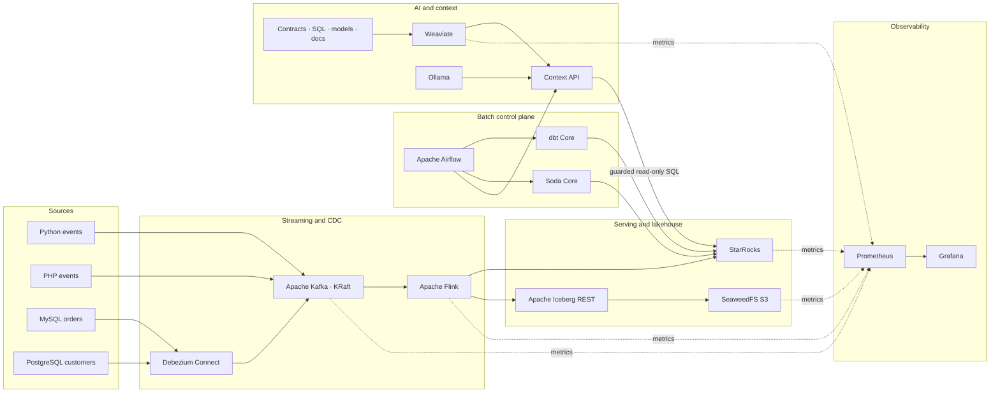

<p align="center">
  
</p>

<h1 align="center">Local Streaming Lakehouse &amp; AI Platform</h1>

<p align="center">
  A production-shaped, fully local reference platform for event streaming, database CDC, real-time analytics, lakehouse storage, data quality, orchestration, observability, and retrieval-augmented AI.
</p>

<p align="center">
  
  
  
  
</p>

This repository demonstrates how application events and relational database changes can move through one coherent data platform. Python and PHP producers publish events, Debezium captures MySQL and PostgreSQL changes, Apache Kafka transports the streams, and Apache Flink processes them into StarRocks and Apache Iceberg. Airflow, dbt, Soda, Prometheus, Weaviate, and Ollama complete the operational and AI layers.

Everything runs on Docker Compose. Optional profiles let a developer start only the capabilities needed for the current experiment.

> [!IMPORTANT]
> This is a local development and learning environment, not a production deployment. The default credentials, anonymous endpoints, and single-node services must not be exposed to untrusted networks.

## See it running

These are live captures from the Compose environment—not mockups.

<table>
  <tr>
    <td width="50%">
      <strong>Continuous stream processing</strong><br>
      <sub>Three Flink pipelines running for events, MySQL CDC, and PostgreSQL CDC.</sub><br><br>
      
    </td>
    <td width="50%">
      <strong>Bounded workflow orchestration</strong><br>
      <sub>Airflow schedules CDC reconciliation, RAG refresh, and hourly data-quality checks.</sub><br><br>
      
    </td>
  </tr>
  <tr>
    <td width="50%">
      <strong>AI context and guarded analytics</strong><br>
      <sub>The local API exposes health, indexing, read-only SQL, and RAG question-answering routes.</sub><br><br>
      
    </td>
    <td width="50%">
      <strong>Platform observability</strong><br>
      <sub>Prometheus collects metrics from Kafka, Flink, SeaweedFS, StarRocks, and Weaviate.</sub><br><br>
      
    </td>
  </tr>
</table>

## What this project demonstrates

- Versioned event contracts shared by independent Python and PHP producers.
- Initial snapshots and continuous CDC from MySQL and PostgreSQL with Debezium.
- Event-time processing, changelog semantics, checkpoints, and dual writes with Flink.
- Mutable, low-latency analytical serving in StarRocks.
- Engine-neutral historical tables in Iceberg on SeaweedFS S3 storage.
- Warehouse transformations and tests with dbt Core.
- Scheduled data-quality checks with Soda Core and Airflow.
- A local context layer using Weaviate, Ollama, repository metadata, and guarded read-only SQL.
- Metrics collection and dashboards with Prometheus and Grafana.

## Architecture



StarRocks and Iceberg intentionally serve different needs:

| Storage target | Responsibility |
|---|---|
| **StarRocks** | Current, query-optimized state for dashboards, dbt models, quality checks, and AI SQL tools. |
| **Iceberg on SeaweedFS** | Durable append history in an engine-neutral table format with local S3-compatible storage and a REST catalog. |

For deeper design rationale, guarantees, and ownership boundaries, see [the architecture guide](docs/architecture.md) and [ADR 0001](docs/decisions/0001-local-stack.md).

## Quick start

### Prerequisites

- Docker Desktop or Docker Engine with Compose v2.
- GNU Make, Python 3, and `curl` on the host.
- At least 12 GB of Docker memory for core plus lakehouse.
- At least 30 GB free inside Docker's storage allocation for images, models, and generated data.

### Start the streaming lakehouse

```bash
cp .env.example .env
make test
make preflight
make up-core
make up-lakehouse
make smoke
```

The startup targets are idempotent:

- `make up-core` starts MySQL, PostgreSQL, Kafka, Debezium, StarRocks, the source generators, and control-plane bootstrap.
- `make up-lakehouse` adds SeaweedFS and Flink, initializes the Iceberg namespace, and submits only missing streaming jobs.
- `make smoke` verifies endpoints, topics, CDC, warehouse tables, Iceberg, and any optional profiles that are running.

### Add optional capabilities

Start optional profiles independently so they do not compete for local memory unnecessarily:

```bash
make up-orchestration
make up-observability

make up-ai
make ai-models
make rag-index
```

The AI model download is explicit because model size and download time differ materially from the rest of the stack. The small local defaults are `nomic-embed-text` for embeddings and `qwen3:1.7b` for answer generation; both can be changed in `.env`.

## Data flows

### Application events

The Python and PHP producers emit the same [versioned JSON contract](contracts/event-v1.schema.json) to separate Kafka topics:

| Source | Kafka topic | Flink outputs |
|---|---|---|
| Python generator | `app.python.events.v1` | `analytics.events_realtime` and `bronze.events` |
| PHP generator | `app.php.events.v1` | `analytics.events_realtime` and `bronze.events` |

Flink applies event-time watermarks, deduplicates current serving rows by key, writes the current view to StarRocks, and appends durable history to Iceberg.

### Relational CDC

The deterministic database seeder continuously inserts, updates, and occasionally deletes source rows. Debezium takes the initial snapshot and then follows the database change logs.

| Source table | CDC topic | Serving table |
|---|---|---|
| MySQL `inventory.orders` | `cdc.mysql.inventory.orders` | `analytics.orders_current` |
| PostgreSQL `public.customers` | `cdc.postgres.public.customers` | `analytics.customers_current` |

Flink decodes Debezium changelogs, and StarRocks primary-key tables apply the corresponding inserts, updates, and deletes.

### Transformations, quality, and orchestration

Flink owns permanent stream processing. Airflow owns bounded workflows and does not wrap or restart the long-running jobs.

| Airflow DAG | Schedule | Responsibility |
|---|---|---|
| `hourly_data_quality` | Minute 7 of every hour | Run `dbt build`, then execute the Soda scan. |
| `daily_cdc_reconciliation` | Daily at 02:20 | Compare bounded source and serving row counts. |
| `daily_rag_context_refresh` | Daily at 03:40 | Refresh repository context when Weaviate is available. |

Run the analytical layers directly when developing:

```bash
make dbt-run
make quality
```

dbt models live in [`dbt/models`](dbt/models), orchestration lives in [`airflow/dags`](airflow/dags), and Soda thresholds live in [`quality/checks.yml`](quality/checks.yml).

## AI and context layer

`make rag-index` recreates the `PlatformContext` collection from the definitions that actually operate the platform: contracts, Flink SQL, Debezium configurations, dbt models, Soda checks, Airflow DAGs, and documentation.

The local API provides:

| Route | Purpose |
|---|---|
| `GET /health` | Report model, vector store, and index availability. |
| `POST /index` | Refresh the context collection; Airflow uses this privately. |
| `POST /ask` | Answer a platform question with retrieved local source paths. |
| `POST /sql` | Execute guarded read-only analytical SQL. |

Example RAG request:

```bash
curl -sS http://localhost:8000/ask \
  -H 'content-type: application/json' \
  -d '{"question":"How many events arrived by producer in the last hour?"}'
```

The SQL route uses a read-only StarRocks user, allows only `SELECT` or `WITH`, rejects multiple statements and comments, blocks write and administrative keywords, and applies a result limit. This is defense in depth for a local demo—not a replacement for authentication, authorization, and a production SQL parser.

CPU-only answer generation can take several minutes. Indexing and deterministic `/sql` queries are much faster.

## Service endpoints

| Service | Local endpoint | Default access |
|---|---|---|
| Airflow | [localhost:8080](http://localhost:8080) | `airflow` / `airflow` |
| Flink | [localhost:8081](http://localhost:8081) | No authentication |
| Debezium Connect | [localhost:8083](http://localhost:8083) | No authentication |
| RAG API | [localhost:8000/docs](http://localhost:8000/docs) | No authentication |
| Weaviate | [localhost:8088](http://localhost:8088) | Anonymous local access |
| SeaweedFS S3 | [localhost:8333](http://localhost:8333) | Values from `.env` |
| Iceberg REST catalog | [localhost:8181](http://localhost:8181) | Local OAuth exchange |
| SeaweedFS admin | [localhost:23646](http://localhost:23646) | Local UI |
| StarRocks FE | [localhost:8030](http://localhost:8030) | Local root user |
| StarRocks SQL | `localhost:9030` | Root or read-only analytics user |
| Prometheus | [localhost:9090](http://localhost:9090) | No authentication |
| Grafana | [localhost:3000](http://localhost:3000) | `admin` / `admin` |
| Ollama | [localhost:11434](http://localhost:11434) | No authentication |

Default values are documented in [`.env.example`](.env.example). Change them before running on a shared workstation, and never commit the generated `.env` file.

## Common operations

```bash
make status          # Show containers and the Flink job overview
make logs            # Follow logs for running services
make bootstrap       # Repeat idempotent control-plane initialization
make submit-flink    # Submit only pipelines not already running
make smoke           # Exercise live platform integrations
make down            # Stop containers and preserve named volumes
make clean           # Delete containers and all generated volume data
```

`make clean` is destructive. See the [operations runbook](docs/runbook.md) before resetting state or troubleshooting a partial startup.

## Local profiles and capacity

| Profile | Main services | Approximate memory ceiling |
|---|---|---:|
| `core` | MySQL, PostgreSQL, Kafka, Connect, StarRocks, generators | 8 GB |
| `lakehouse` | SeaweedFS, Flink JobManager and TaskManager | 4.6 GB additional |
| `orchestration` | Airflow components and metadata PostgreSQL | 2.7 GB additional |
| `quality` | One-shot Soda container | 0.5 GB transient |
| `ai` | Weaviate, Ollama, RAG API | Model-dependent; capped near 6 GB |
| `observability` | Kafka exporter, Prometheus, Grafana | About 1.5 GB |

On a 16 GB Docker VM, run core plus lakehouse first. Stop profiles you do not need or raise Docker's memory limit before starting orchestration and AI together.

<details>
<summary><strong>Pinned component versions</strong></summary>

| Layer | Component | Version |
|---|---|---:|
| Stream transport | Apache Kafka, KRaft mode | 4.1.2 |
| CDC | Debezium Kafka Connect | 3.4.3.Final |
| Stream processing | Apache Flink | 1.20.5 |
| Serving warehouse | StarRocks all-in-one | 4.0.13 |
| Lakehouse tables | Apache Iceberg | 1.11.0 |
| Object storage and catalog | SeaweedFS mini | 4.26 |
| Transformations | dbt Core + dbt-starrocks | 1.12.0 |
| Quality | Soda Core MySQL connector | 3.5.6 |
| Orchestration | Apache Airflow | 3.3.0 |
| Vector context | Weaviate | 1.38.3 |
| Local models | Ollama | 0.12.9 |
| Metrics | Prometheus + Grafana | 3.5.0 + 12.1.1 |

</details>

## Repository map

```text
.
├── airflow/dags/           # Scheduled bounded workflows
├── config/debezium/        # MySQL and PostgreSQL CDC connectors
├── contracts/              # Versioned application event schema
├── dbt/models/             # Staging models, marts, and tests
├── docker/                 # Custom runtime images
├── docs/                   # Architecture decisions and operations guide
├── flink/sql/              # Three long-running streaming pipelines
├── observability/          # Prometheus and Grafana provisioning
├── quality/                # Soda checks and private scan service
├── services/               # Producers, seeder, bootstrap, smoke, and RAG API
├── tests/                  # Repository-level contracts
├── compose.yaml            # Profile-based local platform
└── Makefile                # Supported operator interface
```

## Verification

The repository includes static contracts plus live integration checks:

```bash
make test       # Compose rendering, JSON/contracts, Python compilation
make smoke      # Live topics, CDC, StarRocks, Iceberg, and optional services
make dbt-run    # Warehouse models and dbt tests
make quality    # Soda data-quality checks
```

The checked-in configuration has been exercised end to end with three running Flink pipelines, three discovered Airflow DAGs, passing dbt and Soda checks, a populated Weaviate context collection, local Ollama models, and a successful RAG response.

## Boundaries and production roadmap

- Kafka, StarRocks, SeaweedFS, and the source databases are single-node services; they demonstrate APIs and data semantics, not high availability.
- StarRocks uses an all-in-one image with one replica. Production should separate roles and span failure domains.
- Flink checkpoints survive container replacement inside the local SeaweedFS volume, but deleting Compose volumes removes them.
- Contracts are repository-managed. Add a schema registry when independently deployed producers require compatibility enforcement at publication time.
- Replace example credentials and anonymous endpoints with secret management, TLS, network policy, and role-based access control.
- Add CI, image scanning, lineage, alert routing, backup/restore exercises, and measurable service-level objectives before treating the design as an operational platform.

## Contributing

Issues and focused pull requests are welcome. Keep changes reproducible, pin new images and dependencies, update the architecture documentation when ownership changes, and run `make test` before opening a pull request.
